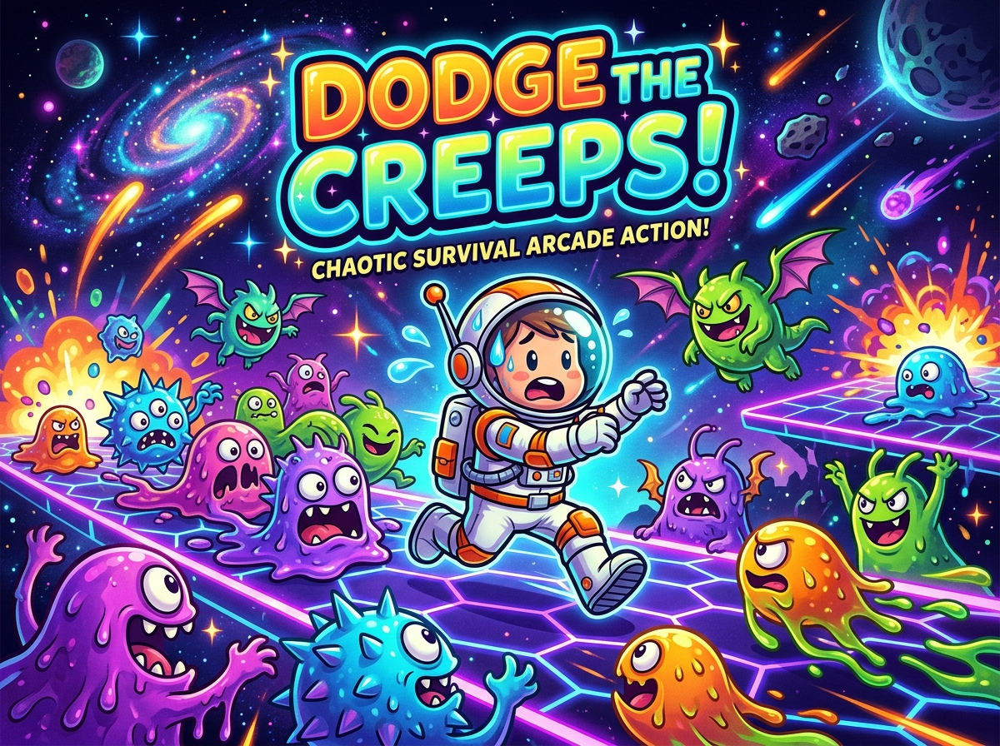

# Abyss Dodge 👾

<div align="center">



[](https://gearsoftca.itch.io/abyss-dodge)
[](https://gearsoftca.itch.io)

🎮 **[¡Juega a Abyss Dodge en Línea directamente en el navegador aquí!](https://gearsoftca.itch.io/abyss-dodge)**

*Un proyecto oficial de **GearSoftCA** creado con Godot Engine 4.*

</div>

---

**Abyss Dodge** es un videojuego 2D de supervivencia arcade donde deberás esquivar oleadas de criaturas y peligros del abismo, desarrollado por **GearSoftCA** en **Godot Engine 4** utilizando **GDScript**.

Este proyecto toma como base las mecánicas esenciales de evasión (*"Your first 2D game"*), optimizado y enriquecido con estándares modernos de desarrollo, diseño de interfaces, exportación multiplataforma y visibilidad web (SEO, GEO y AEO).


---

## 🎮 Descripción del Juego

El objetivo es sencillo pero adictivo: sobrevivir la mayor cantidad de tiempo posible esquivando oleadas de enemigos que aparecen desde los bordes de la pantalla a distintas velocidades y trayectorias.

- **Puntaje**: Aumenta segundo a segundo mientras sigas con vida.
- **Dificultad**: Los enemigos se generan continuamente con velocidades, orientaciones y animaciones aleatorias.
- **Fin del juego**: Tocar a cualquier enemigo termina la partida instantáneamente.

---

## 🕹️ Controles

| Acción | Teclado / Entrada | Mando (Gamepad) |
|---|---|---|
| **Moverse Arriba** | Flecha Arriba / `W` | Stick Izquierdo / D-Pad Arriba |
| **Moverse Abajo** | Flecha Abajo / `S` | Stick Izquierdo / D-Pad Abajo |
| **Moverse a la Izquierda** | Flecha Izquierda / `A` | Stick Izquierdo / D-Pad Izquierda |
| **Moverse a la Derecha** | Flecha Derecha / `D` | Stick Izquierdo / D-Pad Derecha |
| **Iniciar Juego** | Botón en pantalla (*Start*) | Botón Start / A |

---

## 📁 Estructura del Proyecto

```text
primer-juego-2d/
├── art/                 # Recursos gráficos (sprites) y audio (música de fondo y efectos)
├── fonts/               # Tipografías utilizadas en la interfaz (Xolonium-Bold)
├── main.tscn / .gd      # Escena principal: gestiona ciclo de juego, spawneo de mobs y puntaje
├── player.tscn / .gd    # Jugador: movimiento, animaciones y detección de colisiones
├── mob.tscn / .gd       # Enemigos (creeps): movimiento rígido, tipos aleatorios y limpieza
├── hud.tscn / .gd       # Interfaz de usuario (HUD): contador de puntos, mensajes y botón de inicio
├── project.godot        # Configuración principal del proyecto y mapeo de controles
└── export_presets.cfg   # Perfiles de exportación para ejecutables
```

---

## 🚀 Cómo Ejecutar el Proyecto

### Requisitos
- [Godot Engine 4.x](https://godotengine.org/download) (Compatible con Godot 4.x / GL Compatibility)

### Pasos
1. **Clonar o descargar** este repositorio:
   ```bash
   git clone https://github.com/JavierAlburges/primer-juego-2d.git
   ```
2. Abrir **Godot Engine**.
3. En el Administrador de Proyectos, hacer clic en **Importar** (*Import*).
4. Seleccionar el archivo `project.godot` dentro de la carpeta del proyecto y confirmar con **Importar y Editar** (*Import & Edit*).
5. Presionar **F5** (o el botón *Play* en la esquina superior derecha) para ejecutar la escena principal.

---

## 📦 Cómo Exportar y Crear el Ejecutable (.exe)

El proyecto ya cuenta con el perfil de exportación configurado en `export_presets.cfg` para **Windows Desktop** (preset *"Equiva"*).

### Requisito previo
- Tener instaladas las **Plantillas de exportación** (*Export Templates*) en Godot:
  - En el editor, ir a **Proyecto** -> **Instalar plantillas de exportación** (*Project -> Install Export Templates*) y descargarlas/instalarlas para tu versión de Godot.

### Opción A: Desde el Editor de Godot (Interfaz Gráfica)
1. Abrir el proyecto en **Godot Engine**.
2. Ir al menú superior: **Proyecto** -> **Exportar...** (*Project -> Export...*).
3. En la ventana de exportación, seleccionar el preset **Equiva** (Windows Desktop).
4. Hacer clic en **Exportar proyecto...** (*Export Project...*) en la parte inferior.
  5. Seleccionar la ruta de destino (configurado en `builds/Windows/PrimerJuego2D.exe`).
6. Marcar o desmarcar *Export With Debug* según se requiera y pulsar **Guardar**.

### Opción B: Mediante Línea de Comandos (CLI)
Si tienes el binario de Godot configurado en tu terminal:
```bash
# Exportar versión Release (Producción)
godot --headless --export-release "Equiva" builds/Windows/PrimerJuego2D.exe

# O versión Debug (Con consola de depuración)
godot --headless --export-debug "Equiva" builds/Windows/PrimerJuego2D.exe
```

---

## 🌐 Cómo Exportar y Ejecutar en la Web (HTML5 / WebAssembly)

El proyecto cuenta con el preset de exportación **Web** preconfigurado para generar una versión jugable en el navegador dentro de `builds/Web/`.

### Paso 1: Exportar los archivos Web
- **Desde el Editor**:
  1. Ir a **Proyecto** -> **Exportar...** (*Project -> Export...*).
  2. Seleccionar el preset **Web**.
  3. Pulsar **Exportar proyecto...**, seleccionar como destino `builds/Web/index.html` y guardar.
- **Desde la Terminal (CLI)**:
  ```bash
  godot --headless --export-release "Web" builds/Web/index.html
  ```
  Esto generará los archivos `index.html`, `index.js`, `index.wasm` e `index.pck`.

### Paso 2: Servir localmente (Importante para evitar errores de CORS y SharedArrayBuffer)
Los navegadores modernos bloquean archivos WebAssembly si se abren con doble clic directo (`file://`). Debes servirlos con un servidor HTTP local:

- **Con Python**:
  ```bash
  cd builds/Web
  python -m http.server 8000
  ```
  Luego abre en tu navegador: [http://localhost:8000](http://localhost:8000)

- **Con Node.js / npx**:
  ```bash
  npx serve builds/Web

  ```

- **Desde el mismo Godot**:
  En la ventana de **Exportar**, puedes hacer clic en el ícono de **Play / Ejecutar en el navegador** situado en la esquina superior derecha para iniciar un servidor local automáticamente.

### Paso 3: Desplegar en Itch.io (Demo Web Pública)
- **Demo pública activa**: [https://gearsoftca.itch.io/abyss-dodge](https://gearsoftca.itch.io/abyss-dodge)
- Paquete zip de despliegue generado en: `builds/PrimerJuego2D-Web-Itch.zip`.
- Al actualizar o re-exportar para Itch.io:
  1. Exportar preset Web en Godot Engine a `builds/Web/index.html`.
  2. Comprimir el contenido de `builds/Web/` en un archivo `.zip`.
  3. En [itch.io](https://itch.io), actualizar el archivo en el proyecto seleccionando *"This file will be played in the browser"*.


---

## 🎯 Optimización Web: SEO, GEO y AEO

Para maximizar el alcance del juego tanto en buscadores convencionales como en motores de respuestas basados en Inteligencia Artificial y búsquedas regionales:

- **SEO (Search Engine Optimization)**:
  - Títulos y meta descripciones enriquecidas con palabras clave relevantes (`Abyss Dodge`, `GearSoftCA`, `Godot Engine 4`, `Juegos Arcade 2D`).
  - Canonical link configurado hacia `https://gearsoftca.itch.io/abyss-dodge`.
  - Tarjetas Open Graph y Twitter Cards integradas para previsualizaciones atractivas en redes sociales y mensajería (WhatsApp, Telegram, X).
- **GEO (Geographic / Local Optimization)**:
  - Meta etiquetas de geolocalización regional e internacional (`geo.region`, `geo.placename`, `ICBM`) asociando la autoría técnica a **GearSoftCA**.
- **AEO (Answer Engine Optimization & AI Discoverability)**:
  - Datos estructurados **Schema.org (JSON-LD)** tipo `VideoGame` embebidos en el HTML del cliente web.
  - Esto permite que modelos de lenguaje y motores de búsqueda semántica (ChatGPT, Gemini, Perplexity, Bing Copilot) reconozcan de manera unívoca a **Abyss Dodge** como una entidad de videojuego desarrollada por **GearSoftCA**.

---

## 🛠️ Tecnologías Utilizadas

- **Desarrollador / Estudio**: **GearSoftCA**
- **Motor**: [Godot Engine](https://godotengine.org/) (Godot 4.x)
- **Lenguaje**: GDScript
- **Renderizador**: GL Compatibility (D3D12 en Windows)
- **Física 2D**: Motor nativo 2D de Godot / RigidBody2D & Area2D
- **Distribución Web**: HTML5 / WebAssembly en Itch.io
